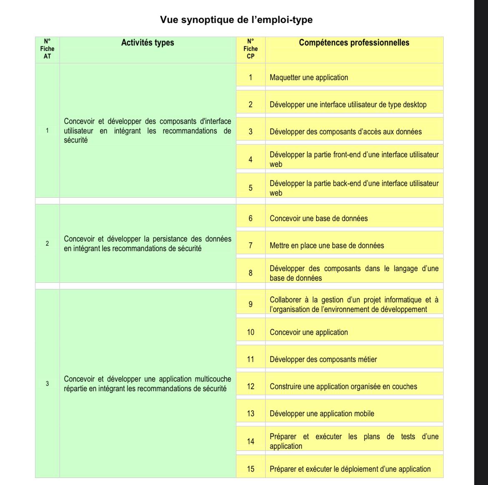

Exemple le projet de Florence : [depot github](https://github.com/Florence-Martin/CDA_fil_rouge)
Daily affilié : [depot github](https://github.com/Simplon-hdf/daily-objectives-cda-vals-p4/blob/main/Jour-32.md)
Repo Simplon Doc : [depot github](https://github.com/Simplon-hdf/bot-discord-Simplon-Hub-doc)

### Dossier Pro de Concepteur d'Application

# Sommaire

## Introduction

Ce dossier de projet a pour objectif de démontrer la maîtrise des compétences requises pour obtenir le titre de Concepteur et Développeur d'Applications. Il présente un projet complet dans lequel j'ai appliqué mes connaissances et compétences dans le domaine du développement logiciel\*\*.
[Lire Plus](1.introduction/introduction.md)

## Conception

Afin de construire une application efficace , il est essentiel de bien comprendre les besoins et les attentes des utilisateurs. Dans ce projet au sein de mon équipe, j'ai appliqué les principes de conception à travers les étapes suivantes :

[Lire Plus](1.conception/conception.md)

## Développement

## Déploiement

